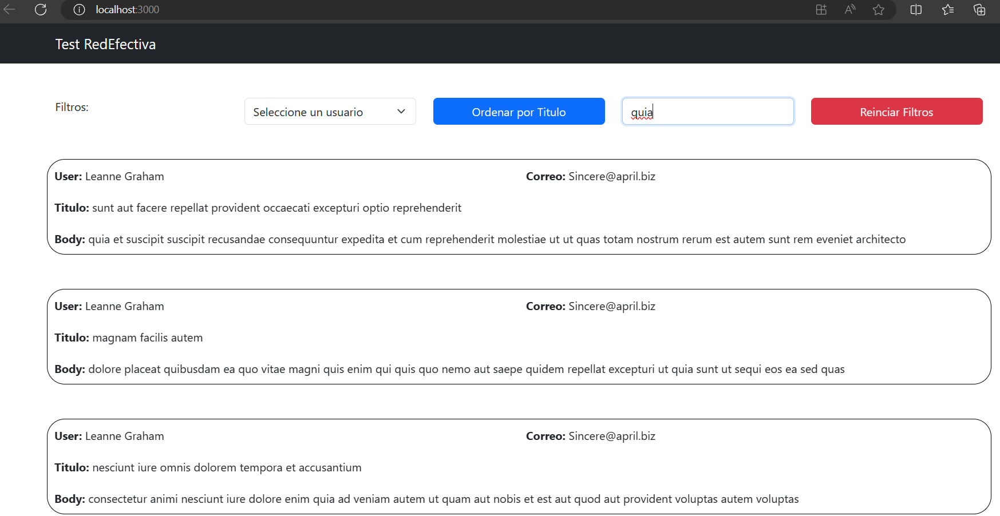

# Instrucciones para levantar el proyecto Node.js con React vía NPM o Docker

Este repositorio contiene un proyecto Node.js con una aplicación frontend construida en React. Se puede utilizar npm o Docker para levantar la aplicación.

## Comandos del Proyecto con NPM

##_Ruta en la que se deberá de ejecutar todo lo indicado en esta guía_##

```..\frontend_sonplaceholder\my-react-app```

### 1. Instalación de dependencias

```npm install```

Este comando instalará todas las dependencias necesarias para el proyecto.

### 2. Instalación de Create React App (si aún no está instalado)

```npm install -g create-react-app```

Este comando instalará globalmente la herramienta Create-React-App, que se utiliza para crear aplicaciones React.

### 3. Instalación de React Bootstrap

```npm install react-bootstrap bootstrap```

Este comando instalará React Bootstrap y Bootstrap, que se utilizan para agregar estilos y componentes a esta aplicación.

### 4. Iniciar la aplicación

```npm start```

Este comando iniciará la aplicación React en modo de desarrollo. Se poodrá acceder a la aplicación desde el navegador en la siguiente ruta http://localhost:3000.


## Comandos para Dockerización del Proyecto

Esta aplicación contiene una receta que permite usar Docker para levantar la aplicación siguiendo los siguientes pasos:

### 1. Construir la imagen Docker

```docker build -t my-react-app .```

Este comando construirá la imagen Docker para la aplicación. Asegúrate de ejecutarlo desde la raíz del proyecto, donde se encuentra el archivo Dockerfile.

### 2. Ejecutar el contenedor Docker

```docker run -p 3000:3000 my-react-app```

Este comando ejecutará el contenedor Docker de la aplicación y mapeará el puerto 3000 del contenedor al puerto 3000 del host. Después de ejecutar este comando, podrás acceder a la aplicación en http://localhost:3000.

Imagen de la aplicación corriendo:

